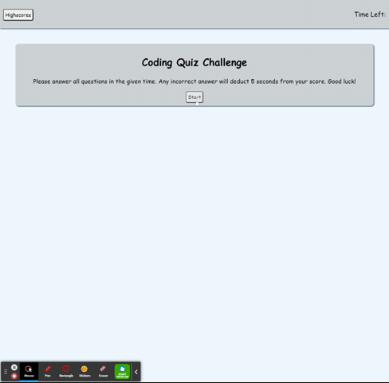

# Coding-Quiz

## Table of Contents

- [Description](#description)
- [Deployed-URL](#deployed-url)
- [Credits](#credits)
- [License](#license)
- [Tests](#tests)
- [Questions](#questions)

## Description

```md
- Create a JavaScript coding quiz
- Clicking the start button begins timer for quiz
- Every incorrect answer deducts 5 seconds
- After answering the question a card will display showing correct or incorrect
- Store score and initials to local storage
- When questions are done or all are answered game will end
```

## Deployed URL

https://dmerk2.github.io/Coding-Quiz/

## Usage



## Credits

```
Daniel Merkin contributed to this project
```

## License

```
MIT License
```

## Test

```
N/A
```

## Questions

GitHub: [dmerk2](https://github.com/dmerk2)<br>
Email: dan.merkin@gmail.com
